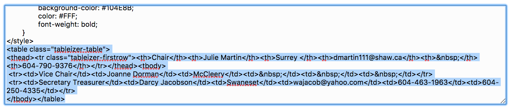
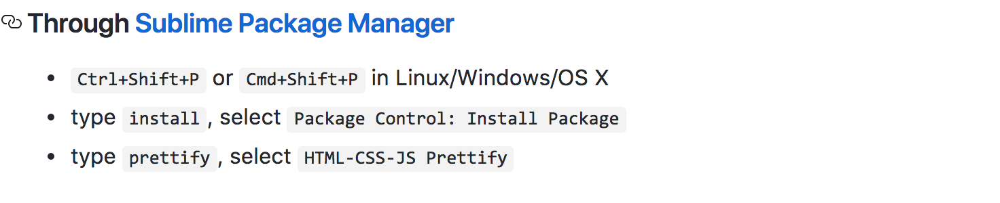
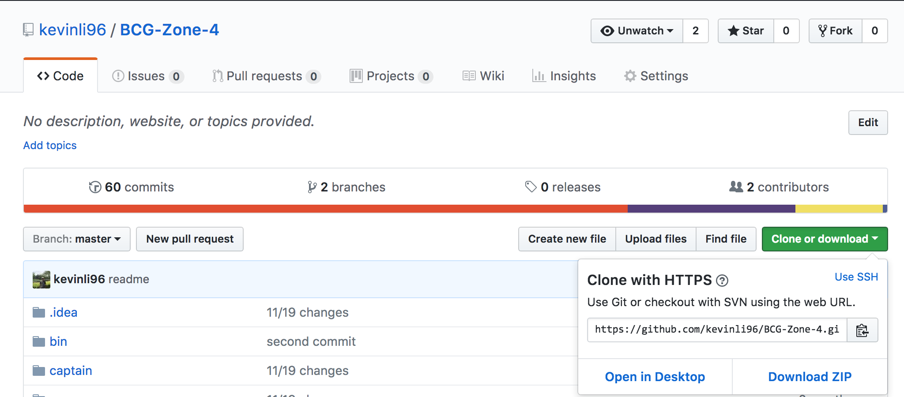
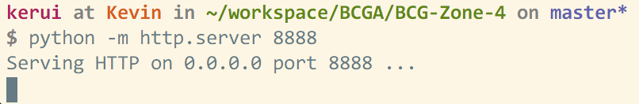
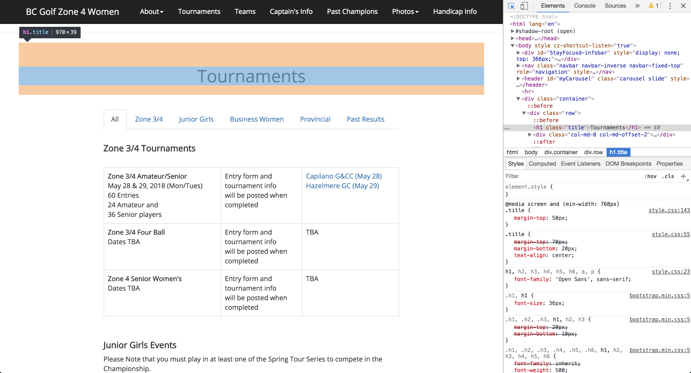

# BC Golf Zone 4 Women - Official Site

## Table of Contents

* [Maintenance](#maintenance)
  * [General](#general)
    * File Naming
    * Updating Background Photos
  * [Teams](#teams)
  * [Tournaments](#tournaments)
  * [Tables](#tables)
  * [Images](#images)
* [Site Training](#site-training)
  * [Installations](#installations)
  * [Local Site Setup](#local-site-setup)
  * [Git Workflow](#git-workflow)
  * [Pushing to Production](#pushing-to-production)
* [Tips](#tips)
  * [Helpful Git Commands](#helpful-git-commands)
  * [Helpful Terminal Commands](#helpful-terminal-commands)

## Maintenance

### General

**File Naming**: Be aware of case sensitivity when naming/renaming files on your file explorer, as this does not affect your localhost site but does affect the GitHub site. i.e. the python server does not care about case sensitivity, so you may run into an instance where you capitalize the first letter in a certain file, and the localhost will work perfectly, but you will run into a 404 error on the GitHub site. 

**Updating Background Photos**: Follow the instructions in the commented code in header.html.  

### Teams

The teams.html file is organized such that the code corresponding to each team (1, 2, 3) is automatically inserted into the "Info" tab (the first tab on the page). Therefore there is no need to make changes twice to modify the individual team information as well as the Info tab. 

### Tournaments

All the separate tournaments have been divided into their respective .html files located in the tournaments/ folder. The files are as follows

* tournaments/business_women.html (business women tournaments)
* tournaments/junior_girls.html (junior girls tournaments)
* tournaments/past_results.html (past results)
* tournaments/provincial.html (provincial tournaments)
* tournamentszone34.html (zone 3/4 tournaments)

### Tables

A simple way to convert excel spreadsheets to HTML table code is to use [Tableizer](http://tableizer.journalistopia.com/). Paste the relevant cells from the spreadsheet into Tableizer, and copy the output of Tableizer into the appropriate .html file located in the tables/ folder. Ensure that you are copying only the code from the first table tag to the closing table tag, as highlighted in the photo below. An alternative is to check the box 'No CSS' on the first page.



After pasting the output of the tableizer conversion into Sublime, use the HTMLPrettify Sublime plugin to format/indent the HTML code. First install Node [here](https://nodejs.org/en/#download). Then in Sublime, follow the below steps (using ctrl + shift + P on windows).



Once installed, to format code on a given page, press ctrl + shift + P again, type HTMLPrettify, and hit enter. Please reference the HTMLPrettify [guide](https://github.com/victorporof/Sublime-HTMLPrettify) if you run into further errors.

The following tables are located in the tables/ folder. 

* tables/bw_executive_table.html (business women executive)
* tables/executive_table.html (zone 4 executive)
* tables/team1.html (team 1 schedule)
* tables/team2.html (team 2 schedule)
* tables/team3.html (team 3 schedule)
* tables/teambw.html (business women team schedule)

### Images

Images for the champions/juniors/assorted photos are located under img/docs/gallery

## Site Training

### Installations

1. Download/install Git.
https://git-scm.com/downloads

2. Download/install Python 3.6.4 (or the latest 3.6.x version)
https://www.python.org/downloads/

3. Open terminal/command prompt and enter the following
    ```console
    git clone https://github.com/kevinli96/BCG-Zone-4
    ```
An alternative to the above terminal/command prompt step is to manually download the Git repository from the GitHub website [here](https://github.com/kevinli96/BCG-Zone-4). Click on the green 'Clone or download' button and then click 'Download ZIP.' A screenshot of the github homepage is located below.



A folder named "BCG-Zone-4" will be created." This may take time depending on your internet connection. When this is finished executing, you now have a local copy of the repository. You can browse all the code that is part of the repository, in the directory that was just created.

### Local Site Setup

Because of [CORS](https://developer.mozilla.org/en-US/docs/Web/HTTP/CORS) (cross-origin resource sharing), we need to set up a local web server on our computer in order to fully run the website. Otherwise, a lot of the formatting and images will not come out as they are supposed to. However, setting up a local web server is really simple with python installed.

1. Navigate in terminal/command prompt to the "BCG-Zone-4" folder. Enter the following command:

  ```console
  python -m http.server 8888
  ```

  The number 8888 is an arbitrary port number. This can be any port, but the default is usually 8888. You should see something similar to the following:

  

  The ~/workspace/BCGA/BCG-Zone-4 is the location of the terminal/command prompt. This will be different depending on where you have downloaded (git cloned) the BCG-Zone-4 directory. For example, this could be ~/Desktop/BCG-Zone-4, if you downloaded the directory onto your desktop.

2. Open a web browser (Chrome works best) and go to the address: *localhost:8888*

  

  Notice that the terminal/command prompt will output a few lines to confirm that you are retrieving resources (images and formatting scripts) from this local python web server.

  

### Git Workflow

1. Open Windows Powershell (or command prompt or terminal on Mac) and navigate to the BCG-Zone-4 directory (using cd commands, with "cd .." bringing you up a single directory)

2. Ensure that you have the latest changes from the GitHub repository by pulling

  ```console
  git pull
  ```

3. Start your work session (setting up python web server and sublime text editor)

  * Make edits in Sublime Text (or preferred text editor), remembering to save your changes (ctrl + s)
  * Verify changes in your web browser on the localhost (typically Google Chrome, at localhost:8888). Ensure that the cache is disabled by:
    * Opening up chrome developer tools (right click anywhere on the page -> inspect OR ctrl + shift + I)
    * Go to network tab
    * Click disable cache 

  The cache will be disabled only when the chrome developer tools pane is open. There's not much else in the network tab that is worth exploring, but the elements tab provides you with an in-browser look at the html code of the page. This is useful because the button on the top-left corner of the developer tools window will automatically locate in the html code the highlighted element. This is shown in the screenshot below. 

  

  An alternative way of disabling caching is to open up localhost in an incognito tab (ctrl + shift + n). 

4. Add, commit and push local code to the GitHub repository

  Although we have just created a clone of the repository, any changes you make to these files will not persist in the remote, or master version that is the repository at the GitHub link (https://github.com/kevinli96/BCG-Zone-4). These files will have to be 'committed' and 'pushed' to the master, and by extension, the website hosted at https://kevinli96.github.io/BCG-Zone-4/. 

  NOTE: Even when changes have been successfully pushed, and the GitHub repository has been modified to reflect these changes, the site at https://kevinli96.github.io/BCG-Zone-4/ may take a few minutes to respond. I've found that it is quicker to open up the site in an incognito tab (and the changes can be seen immediately when done this way). Otherwise, even when the cache is disabled, it may take a while for a regular browser window to see the most recent modifications to the repository.

  ```console
  git add -A
  git commit -m "commit message"
  git push (git push -u origin master)
  ```

  Line by line:
  1. We must incorporate all the changes we made to the repository, so we must add the files with the (-A) argument denoting 'all' changes to our files.
  2. We commit, or persist the files we added to the local version of the repository. Every commit requires a commit message, therefore the (-m) argument gives the 'commit' a commit message of the following text in quotes. This is up to the user to fill in, and is for documentation purposes. E.g. it could range anywhere from "replaced team 1 results pdf" to "small style change to home page"
  3. Push the committed code to the master version. If there is an error denoting upstream branches, execute the full command ("git push -u origin master"). Otherwise, "git push" will suffice.

  If at any point something unexpected comes up, CTRL+D or CTRL+C will terminate command execution and will return you to the command prompt.

### Pushing to Production

We will be using [git-ftp](https://github.com/git-ftp/git-ftp/blob/master/README.md) to upload the most recently committed files from our github repository to the live site. 

**Installation** (for Windows systems):

1. Delete your "Git" directory, either in C:/Git or C: Program Files/Git
2. Download [Git for Windows](https://git-for-windows.github.io/)
3. Install using defaults
4. In your search bar type "Environment Variables" click on the words
5. Under "User variables .." click on "NEW"
6. In the "Variable Name" type "PATH"  (Do not type the quotes "")
7. In the "Variable Value" type "C:\Program Files\Git\mingw64\bin;"
  

Right click and "Run as Administrator" on Git Bash on your desktop or it is located in `C:\Program Files\Git` by default, and execute the following commands.

```bash
curl https://raw.githubusercontent.com/git-ftp/git-ftp/master/git-ftp > /bin/git-ftp
chmod 755 /bin/git-ftp
```

From there, you should be able to execute `git-ftp` in your command prompt (Windows Powershell)

```bash
> git-ftp
git-ftp <action> [<options>] [<url>]
```

That is, you won't receive an error when you enter `git-ftp` in the command line, but rather it prompts you for options to append onto the `git-ftp` command.

**Setup**:

Before we configure git-ftp, make sure you are in the folder corresponding to the github repository on your local machine. Then ensure that the most recent commit to the github repository is the latest pushed version of the production site. We need to make sure of this because git-ftp will only push to the live site the files that been modified relative to your last commit. Therefore, if we have pulled in the most recent commit (by doing a `git pull`), and begin our setup of git-ftp, then we will have successfully synced up git-ftp to match the commit history of the github repository. 

Execute the following commands in Powershell/command prompt 

```sh
# Pull in the most recent commit
git pull

# Setup
Type exactly as shown:
git config git-ftp.url "ftp://ftp.bcgazone4.org/public_html/women"
git config git-ftp.user "bcga"
git config git-ftp.password "Xxbcg2019" 

# Since the files already exist on the production site, we 'catchup' git-ftp so as to tell git-ftp that future changes will be relative to our most recent commit
git ftp catchup

# Test to ensure git-ftp has been configured correctly
echo "testing git ftp" >> git_ftp_test.txt
git add -A
git commit -m "Add new content"
Ensure that you can access the git-ftp-test.txt on your Local Host - this is the link https://kevinli96.github.io/BCG-Zone-4/git-ftp-test.txt

git ftp push
# 1 file to sync:
# [1 of 1] Buffered for upload 'index.txt'.
# Uploading ...
# Last deployment changed to ded01b27e5c785fb251150805308d3d0f8117387.
```

If you receive something similar to the last message above, then git-ftp has been successfully configured.

In the future, once changes have been added and committed (and tested on localhost to ensure that they are working properly), all that is needed is to push the modified files onto the production site is the following.

```sh
git ftp push 
```

## Tips

### Helpful Git Commands

```console
git status
```

"git status" checks whether any files have been added or committed, and is a useful check to determine which git command you should run next.

```console
git stash
```

If you run into a merge conflict, or there files you have worked on whose changes you would like to discard, "git stash" will do this. It resets the state of your local repository to the last time you pushed to the master.

```console
git pull
```

Sometimes, you will need to incorporate changes made by another collaborator to your local codebase. "git pull" does exactly that, and takes all modified files from the master and syncs up the repository with your local. Be careful using this if you know that other collaborators have changed files that you are working on (or vice versa, if you begin working on files that others have modified).


### Basic terminal commands
PC: http://www.digitalcitizen.life/command-prompt-how-use-basic-commands/

MAC: https://computers.tutsplus.com/tutorials/navigating-the-terminal-a-gentle-introduction--mac-3855
