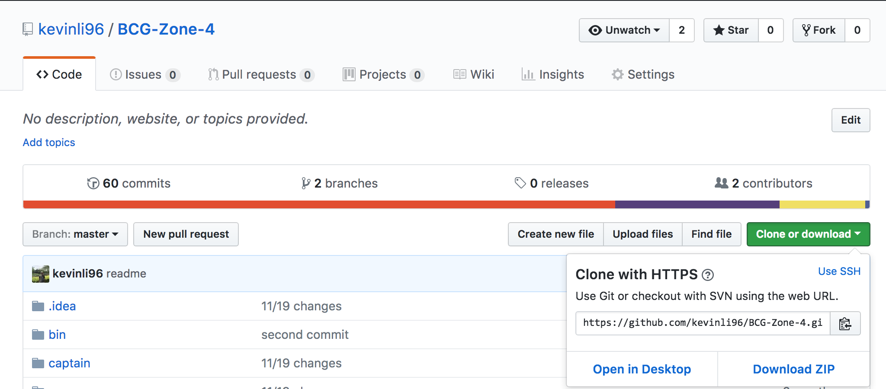
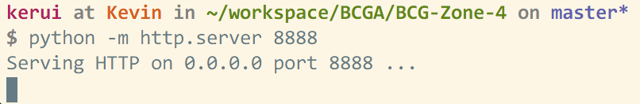
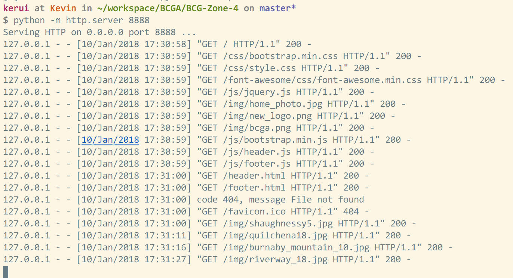

# BC Golf Zone 4 Women - Official Site

## Site Training

### Installations

1. Download/install Git.
https://git-scm.com/downloads

2. Download/install Python 3.6.4 (or the latest 3.6.x version)
https://www.python.org/downloads/

3. Open terminal/command prompt and enter the following
    ```console
    git clone https://github.com/kevinli96/BCG-Zone-4
    ```
An alternative to the above terminal/command prompt step is to manually download the Git repository from the GitHub website [here](https://github.com/kevinli96/BCG-Zone-4). Click on the green 'Clone or download' button and then click 'Download ZIP.' A screenshot of the github homepage is located below.



A folder named "BCG-Zone-4" will be created." This may take time depending on your internet connection. When this is finished executing, you now have a local copy of the repository. You can browse all the code that is part of the repository, in the directory that was just created.

### Local site setup

Because of [CORS](https://developer.mozilla.org/en-US/docs/Web/HTTP/CORS) (cross-origin resource sharing), we need to set up a local web server on our computer in order to fully run the website. Otherwise, a lot of the formatting and images will not come out as they are supposed to. However, setting up a local web server is really simple with python installed.

1. Navigate in terminal/command prompt to the "BCG-Zone-4" folder. Enter the following command:

  ```console
  python -m http.server 8888
  ```

  The number 8888 is an arbitrary port number. This can be any port, but the default is usually 8888. You should see something similar to the following:

  

  The ~/workspace/BCGA/BCG-Zone-4 is the location of the terminal/command prompt. This will be different depending on where you have downloaded (git cloned) the BCG-Zone-4 directory. For example, this could be ~/Desktop/BCG-Zone-4, if you downloaded the directory onto your desktop.

2. Open a web browser (Chrome works best) and go to the address: *localhost:8888*

  

  Notice that the terminal/command prompt will output a few lines to confirm that you are retrieving resources (images and formatting scripts) from this local python web server.

  

## End of site training (the rest will follow the agenda on the google docs)

### Helpful git commands

```console
git status
```
"git status" checks the status of your local repository (whether any files have been added, committed, or if you have not made any changes at all). I use this command when I first begin working, to see if there were any files from a previous session that I did not commit to the master.

```console
git stash
```

If there have been files you worked on whose changes you would like to discard, "git stash" resets the state of your local repository to the last time you pushed to the master.

```console
git pull
```
Sometimes, you will need to incorporate changes made by another collaborator to your local codebase. "git pull" does exactly that, and takes all modified files from the master and syncs up the repository with your local. Be cautious using this if you know that other collaborators have changed files that you are working on (or vice versa, if you begin working on files that others have modified), as this can lead to merge conflicts.


### Committing and pushing local code to master

Although we have just created a clone of the repository, any changes you make to these files will not persist in the remote, or master version that is the repository at the GitHub link (https://github.com/kevinli96/BCG-Zone-4). These files will have to be 'committed' and 'pushed' to the master, and by extension, the website hosted at https://kevinli96.github.io/BCG-Zone-4/
Say you want to replace a file to the website, e.g. a team schedule or results page.

1. Execute the given change (e.g. pdf/excel/image replacement, small change to the home page text).

2. Execute the following commands in terminal/command line

```console
git add -A
git commit -m "commit message"
git push
```

Line by line:
1. We must incorporate all the changes we made to the repository, so we must add the files with the (-A) argument denoting 'all' changes to our files.
2. We commit, or persist the files we added to the local version of the repository. Every commit requires a commit message, therefore the (-m) argument gives the 'commit' a commit message of the following text in quotes. This is up to the user to fill in, and is for documentation purposes. E.g. it could range anywhere from "replaced team 1 results pdf" to "small style change to home page"
3. Push the committed code to the master version. If there is an error denoting upstream branches, execute the full command ("git push -u origin master"). Otherwise, "git push" will suffice.

If at any point something unexpected comes up, CTRL+D or CTRL+C will terminate command execution and will return you to the command prompt.

### Basic terminal commands
PC: http://www.digitalcitizen.life/command-prompt-how-use-basic-commands/
MAC: https://computers.tutsplus.com/tutorials/navigating-the-terminal-a-gentle-introduction--mac-3855
